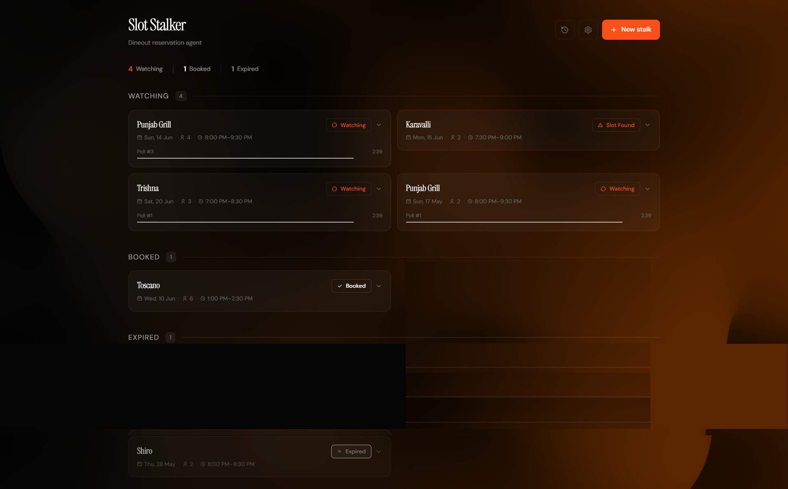

# Slot Stalker — Swiggy Dineout MCP Agent



Slot Stalker is an AI-powered conversational web agent designed to help users effortlessly find, track, and manage restaurant reservations. Built for the **Swiggy Builders Club**, it leverages LLMs and the Swiggy Dineout MCP (Model Context Protocol) to parse natural language queries, automatically execute booking workflows, and continuously monitor unavailable slots until a table opens up.

## How It Works
1. **Natural Language Intent Parsing**: Uses the Groq API (Llama 3) to extract structured booking requests (e.g., *"Book Indian Accent for 2 this Saturday at 8pm"* → `JSON`).
2. **Continuous Polling (Stalking)**: Enters a `WATCHING` state to constantly monitor restaurant availability.
3. **Smart Alternatives**: If the desired slot isn't available, it scores and suggests the top 3 alternatives based on Cuisine, Price Range, Time Proximity, and Ratings.
4. **Seamless Booking**: Transitions to `SLOT_FOUND` and eventually `BOOKED` upon user confirmation using Swiggy's Dineout API.

## Tech Stack
- **Framework**: Next.js 16.3.4 (App Router)
- **UI**: React 19.2.x, Tailwind CSS 4.1.x, shadcn/ui
- **Language**: TypeScript 5.8.x
- **AI/LLMs**: Groq SDK (Intent Parsing), Anthropic SDK (MCP Orchestration)
- **Architecture**: Stateful polling agent mechanism

## Getting Started

### Prerequisites
- Node.js 22.x or higher
- Groq API Key (for intent parsing)

### Installation
1. Install dependencies:
   ```bash
   npm install
   ```
2. Copy the environment variables file and fill in your keys:
   ```bash
   cp .env.local.example .env.local
   ```
3. Run the development server:
   ```bash
   npm run dev
   ```

## Demo Mode vs. Production

By default, the application runs in **Demo Mode**:
- Set `NEXT_PUBLIC_DEMO_MODE=true` in `.env.local`.
- Uses simulated Swiggy MCP responses (`lib/mock-mcp.ts`), in-memory state, and mock restaurant data to prevent live API hits.
- Perfect for UI testing and evaluating the agent logic and scoring algorithms.

### API Access Controls
Non-demo API access uses one server-configured service principal per deployment:
```dotenv
NEXT_PUBLIC_DEMO_MODE=false
SLOT_STALKER_API_TOKEN=<a-long-random-server-secret>
SLOT_STALKER_API_USER_ID=alice
```
Send `Authorization: Bearer <token>` (or `X-API-Key`) and `x-user-id: alice`. The principal must be 1–64 letters, digits, underscores, or hyphens. Missing or invalid server configuration fails closed. A valid token with a different `x-user-id` receives `403`; query parameters and request bodies cannot override the principal. Restart the server after changing this configuration.

This credential grants access only to its configured principal. Keep it on a trusted server; never expose it in browser code or a `NEXT_PUBLIC_*` variable. A proxy cannot use this shared token to select different users. Production multi-user access requires a separate authentication integration that derives each user's identity from a verified credential; that integration is not implemented here.

The included browser UI is demo-only: it uses `demo_user`, sends no service token, and has no sign-in. For the local browser demo, set `NEXT_PUBLIC_DEMO_MODE=true` and leave both service settings empty. Demo identity headers and fallbacks exist solely for local simulation, with no user isolation guarantee. If a token is configured in demo mode, its principal and matching identity header are required as well.

Rate limits, booking guards, and stalk records are stored per Node process. They are not shared across replicas or durable across restarts. Simultaneous booking confirmations for one stalk are rejected while its first booking is running; a durable store and provider idempotency are required before real multi-instance booking use.

Preference edits through `PATCH /api/stalk/[id]` are allowed only while a stalk is `WATCHING`. Selected slots and completed bookings cannot have their party size or time changed through that endpoint.

### Verification
```bash
npm test
npm run typecheck
npm run lint
npm run build
```
The regression tests use local in-memory data and do not call Groq or live booking services.

### Live service integration (not implemented)
The agent currently calls `lib/mock-mcp.ts` even when demo mode is disabled. These settings are placeholders for a future Swiggy Dineout MCP integration:
- Set `NEXT_PUBLIC_DEMO_MODE=false`.
- Provide `SWIGGY_DINEOUT_MCP_URL`, `SWIGGY_CLIENT_ID`, and `SWIGGY_CLIENT_SECRET` in `.env.local`.

## Project Structure
- `app/` - Next.js App Router UI and Backend API Routes (`/api/stalk/*`, `/api/poll/*`, `/api/book/*`).
- `components/` - React components including Dashboard, Stalk Cards, and Alternatives list.
- `lib/` - Core logic: `agent.ts` (orchestration), `groq.ts` (LLM intent), `scoring.ts` (alternatives algorithm), `state.ts` (in-memory store), and `mock-mcp.ts`.

## License
MIT License
